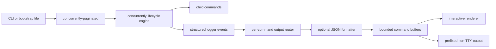

# Product Concept

## Summary

`concurrently-paginated` is a terminal user interface for development workflows that run several long-lived commands through [`concurrently`](https://www.npmjs.com/package/concurrently). It preserves `concurrently` as the process lifecycle engine while replacing interleaved output with one buffered log view per command.

The package supports two adoption paths:

1. An inline CLI for scripts that only need command names and command strings.
2. A programmatic API for bootstrap files that need command-specific environment, working-directory, restart, or lifecycle options.

## Problem

Traditional concurrent output interleaves logs from every process. This makes it difficult to follow one service, compiler, watcher, or proxy during a noisy development session. Terminal scrollback alone does not solve the problem because output from unrelated commands remains mixed together and fixed navigation context is lost while scrolling.

## Product Principles

- Keep process management delegated to `concurrently` rather than reimplementing spawning, restart, signal, and kill behavior.
- Give every command an independent bounded history.
- Keep the selected command title and command tabs fixed while logs move beneath them.
- Preserve child-process ANSI colours and wrap long output without dropping content.
- Degrade to ordinary prefixed streaming output when no interactive TTY is available.
- Treat optional enhancements such as `jq` as capabilities, never hard requirements.
- Restore the user's terminal state reliably after normal completion, failure, or interruption.

## Current Experience

The interactive interface uses the terminal alternate screen and contains:

- A fixed title bar showing the selected command, lifecycle state, and whether the view is live or browsing history.
- A fixed controls row.
- A log viewport with ANSI-aware wrapping and per-command scroll history.
- A compact bottom tab bar with status indicators, an `ALL` view, and overflow markers when all tabs cannot fit.
- Search and filtering within the selected command history, including match highlighting and next/previous navigation.

Keyboard controls:

| Key                     | Action                                          |
| ----------------------- | ----------------------------------------------- |
| `Tab`, `Right`          | Switch to the next command or `ALL` view        |
| `Shift+Tab`, `Left`     | Switch to the previous command or `ALL` view    |
| `/`, `s`                | Search the selected history                     |
| `Enter`, `Esc`          | Apply or cancel search entry                    |
| `Up`, `Down`            | Accelerated scroll; cycle matches during search |
| `n`, `N`                | Next or previous search match                   |
| `?`                     | Show keyboard shortcuts                         |
| `1`-`9`                 | Jump directly to a command                      |
| `Page Up`, `Page Down`  | Scroll one viewport                             |
| `Space`, `End`          | Return to live output                           |
| `q`, `Ctrl+Q`, `Ctrl+C` | Stop all commands                               |

## Public Interfaces

### CLI

```sh
concurrently-paginated \
  --names PROXY,SERVER,CLIENT \
  "npm run proxy" \
  "npm run server" \
  "npm run client"
```

The `concp` alias provides the same command.

### Programmatic API

```js
const { runPaginated } = require("concurrently-paginated");

runPaginated(
  [
    { name: "PROXY", command: "npm run proxy" },
    { name: "SERVER", command: "npm run server" },
  ],
  {
    concurrently: {
      killOthersOn: ["failure", "success"],
      restartTries: 3,
    },
    formatJsonLogs: true,
    maxBufferLines: 2000,
  },
);
```

## Architecture



`concurrently` owns command creation, completion, restart, and termination. A structured `Logger` subscription captures output before short-lived commands can exit. The output router separates partial lines by command index. The renderer owns only presentation, navigation, wrapping, and buffered history.

## JSON Logs

When `jq` exists, complete JSON log lines are validated with `JSON.parse` and then passed through `jq --color-output .`. Invalid JSON, unavailable `jq`, process errors, and disabled formatting all preserve the original line. Ordinary text never incurs a `jq` process spawn.

## Non-TTY Behaviour

CI, redirected output, and unsupported terminals receive conventional output:

```text
SERVER listening on 4000
CLIENT compiled successfully
```

This keeps logs searchable and avoids terminal control sequences outside an interactive session.

## Packaging And Adoption

The package is CommonJS with bundled type declarations and requires Node.js 18 or newer. It publishes only the CLI, source, documentation, README, and package metadata. Tests use Node's built-in test runner.

During local Product Page integration, use a relative development dependency:

```json
{
  "devDependencies": {
    "concurrently-paginated": "file:../../Personal/concurrently-paginated"
  }
}
```

Before publishing, validate the packed artifact in a fresh temporary consumer project. A directory reference is appropriate for active local development; consumers should use a registry version after publication.

## Known Constraints

- Only the first nine commands have direct numeric shortcuts; all commands remain reachable with tab or arrow navigation.
- History is bounded by logical input lines. Wrapped visual rows may consume more screen history than the configured logical-line count suggests.
- Display width currently counts Unicode code points rather than terminal cell width, so some wide glyphs may align imperfectly.
- JSON formatting runs one `jq` process per complete JSON line and may need batching or a persistent formatter for extremely high-volume structured logs.
- The alternate-screen approach intentionally replaces native terminal scrollback with package-managed per-command history.

## Future Directions

- Mouse wheel and clickable tab support where terminal protocols permit it.
- Search and filtering within the selected command history.
- Pause/follow indicators and unread-output badges per tab.
- Config-file loading directly from the CLI.
- Theme and colour customization.
- Horizontal scrolling as an alternative to wrapping.
- Better terminal-cell width handling for Unicode and combining characters.
- Persistent or in-process JSON formatting for high-throughput logs.
- Windows Terminal and cross-shell compatibility coverage in CI.
- Snapshot or model-based renderer tests across terminal dimensions.

## Ideas

These are candidate enhancements for exploration rather than committed roadmap items.

The search mode, richer tab bar, and `ALL` logs tab described in the original exploration notes are now part of the current experience.

## Release Checklist

1. Run `npm test` and `npm run lint`.
2. Run `npm pack --dry-run` and inspect included files.
3. Install the produced tarball into a clean temporary project.
4. Exercise both the CLI and programmatic API.
5. Run a pseudo-terminal smoke test to verify alternate-screen entry, rendering, and cleanup.
6. Confirm the intended npm package name is still available immediately before publishing.